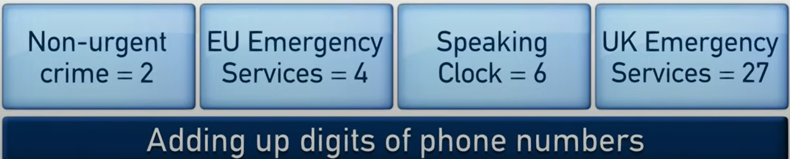

# Welcome to the Only Connect game

Note to everyone who visits this repository: I am really good at CSS. I promise you. But I just didn't care in this repo that much.

Let's get started our tour.

### What's this repository/game?
Do you ever watched legendary British tv show Only Connect. Yeah that's it. But waaaay more simpler version. Because I am doing this project only before waiting for dinner.

### What can we expect from this project?
Well... I am trying to polish basic first round of the game. If I am quick enough I will be adding second and third rounds to the game.

### How can I play this game? What is the objective?
Game is actually simple. You are just going to choose category from the screen. At this very first stages it doesn't matter which one you choose but in the future it will be. (Wait for the new versions/updates)

After that main goal you have to find the connection of clues based on the clues that you are going to see every 10 seconds. You might want to be quick. Because every new clue will decrease the points that you are going to recieve.

If you can find the clue just inform the host. (Yeah there will be a host in this game otherwise how can you decide whether the answer is true or not)

Then repeat the process and don't forget to have fun.

### What are the clues and connections can you give me an example?

Yes sir.



First clue Non-urgent crime is 101 -> 1+0+1 = 2

Second clue EU Emergency Services is 112 -> 1+1+2 = 4

Third clue Speaking Clock is 123 is 123 -> 1+2+3 = 6

Fourth clue UK Emergency Services is 999 -> 9+9+9 = 27


Connection of all these clues you are adding up digits of phone numbers related of the clues.

#### How can I play or see the project development?
This project is under development. So it will be constantly updated. If you want to run and see this project just clone the project, install npm packages by ```npm install``` and run with ```npm start``` commands.

## DEEP NOTES
Clues and connections are Turkish because I am testing this game with my friends. Sorry for irrelevancy because this readme is English.